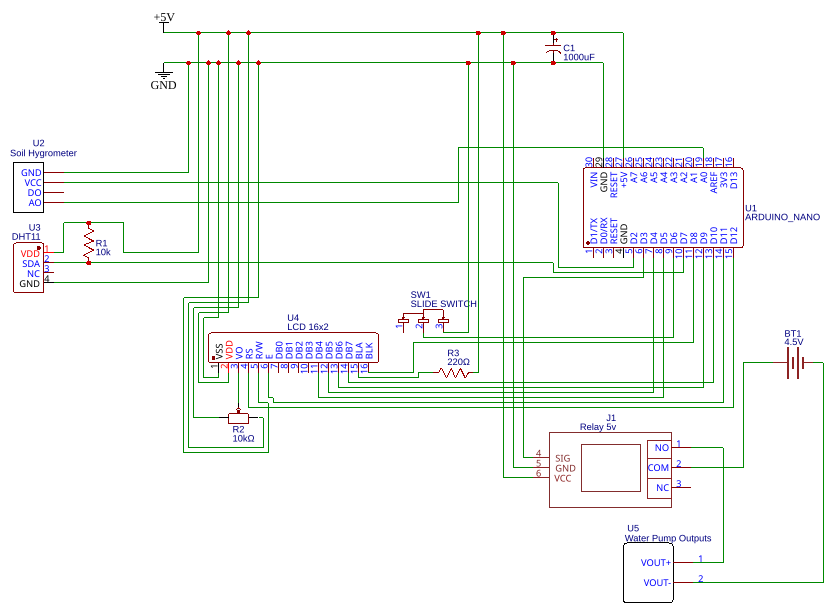

# TR/ENG
# Türkçe
# Otomatik Sulama Sistemi 🌿💧

Saksı bitkileri yetiştirmek için tasarlanmış, enerji tasarruflu ve tamamen otomatik bir sulama sistemi. Bu proje, toprak nem seviyesini anlık olarak izlemek için bir analog nem sensörü kullanır; toprak kuruduğunda ise **Arduino Nano** aracılığıyla röle modülünü tetikleyerek 5V su pompasını otomatik olarak çalıştırır. Sistem durumu ve veriler 16x2 LCD ekranda anlık olarak gösterilir.

## 🚀 Öne Çıkan Özellikler

- Aşırı veya yetersiz sulamayı önlemek için toprağın nem durumu sürekli analiz edilir.
- Kontrol devresi (Arduino ve sensörler) ile yüksek akım çeken yük (su pompası) tamamen bağımsız güç kaynaklarından beslenir. Bu sayede motor parazitleri engellenir ve Arduino'nun kilitlenmesi/reset atması önlenir.
- LCD ekranın arka ışık katotu (-) doğrudan Arduino'nun dijital `D8` pinine bağlanmıştır. Işık buton ile isteğe bağlı açılır, sistem boşta beklerken kapatılarak pil ömrü maksimuma çıkarılır.
- Paylaşılan standart devre şeması; herhangi bir 5V USB adaptör, bilgisayar bağlantısı veya standart pillerle tamamen uyumludur. Eğer powerbank kullanılacaksa ve bir süre sonra powerbank kendi kendini kapatıyorsa, düşük akım modu açılmalıdır. Eğer bu mod yoksa, Arduino`nun 5V ve GND pinlerini birleştiren 220 ohm değerinde direnç kullanılabilir. Bu direnç powerbank`den çekilen akımı artırarak kapanmamasını sağlamaktadır. 
Bazı powerbankler için 1 adet direnç yeterli olmamaktadır. Bu durumda dirençlerin sayısı artırılabilir. (Ben bu senaryoyu yaşadım ve 4 adet 220 ohm direnç kullanarak bu sorunu çözdüm.)

## 🛠️ Kullanılan Donanımlar

- Arduino Nano
- Toprak Nem Sensörü (YL-69 (FC-28))
- DHT11
- 5V Röle Modülü
- 6V Dalgıç Su Pompası ve hortum
- 16x2 LCD Ekran
- Powerbank (Arduino için) & Harici Pil Bloğu (Pompa için)
- Kaydırmalı Anahtar, 10k ohm potansiyometre, 10 k ohm direnç, 220 ohm direç, 1000 uF kondansatör
- Breadboard, dişi-erkek ve erkek-erkek jumper kablo, bakır tel (pil bloğunu birleştirmek için)

## 📊 Devre Şeması

# English
# Automatic Irrigation System 🌿💧
An energy-efficient, fully automated irrigation system designed for potted plants. This project uses an analog moisture sensor to continuously monitor soil moisture levels; when the soil dries out, an **Arduino Nano** triggers a relay module to automatically turn on a 5V water pump. System status and data are displayed in real time on a 16x2 LCD screen.

## 🚀 Key Features
- Soil moisture is continuously analyzed to prevent both overwatering and underwatering.
- The control circuit (Arduino and sensors) and the high-current load (water pump) are powered by completely separate power sources. This prevents motor-induced noise/interference and avoids Arduino freezing or resetting.
- The LCD's backlight cathode (-) is connected directly to the Arduino's digital `D8` pin. The light can be turned on optionally via a button, and is kept off while the system is idle to maximize battery life.
- The shared standard circuit schematic is fully compatible with any 5V USB adapter, computer connection, or standard batteries. If a power bank is used and it eventually shuts itself off, a low-current mode should be enabled. If this mode isn't available, a 220-ohm resistor can be used to connect the Arduino's 5V and GND pins. This resistor increases the current drawn from the power bank, preventing it from shutting down.
For some power banks, a single resistor isn't enough. In that case, the number of resistors can be increased. (I encountered this scenario myself and solved it by using 4 220-ohm resistors.)

## 🛠️ Hardware Used
- Arduino Nano
- Soil Moisture Sensor (YL-69 (FC-28))
- DHT11
- 5V Relay Module
- 6V Submersible Water Pump and hose
- 16x2 LCD Screen
- Power Bank (for Arduino) & External Battery Pack (for the pump)
- Slide Switch, 10k ohm potentiometer, 10k ohm resistor, 220 ohm resistor, 1000 µF capacitor
- Breadboard, female-male and male-male jumper wires, bare copper wire (for connecting the battery pack)

## 📊 Circuit Diagram

